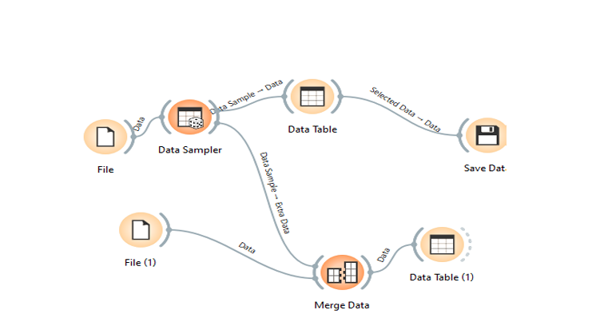

# 🧠 Income and Demographics Analysis Using US Census Data

This project performs a comprehensive data mining analysis using US census data. It includes preprocessing, fairness evaluation, income prediction models, election-related demographic analysis, and an independent research hypothesis. All visualizations, statistical insights, and machine learning methods are structured for reproducibility and transparency.

[📄 View Full Report (PDF)](./PDF.pdf)

---

## 📊 Part 1: Data Preprocessing

This phase cleans and transforms the raw census data into an analysis-ready format.

### Key Steps:
- Reduced dataset from 1M+ to 5,000 entries for efficiency.
- Converted numerical codes to meaningful labels for variables such as sex, race, and occupation.
- Verified and handled missing data.
- Conducted initial exploratory data analysis.

### Sample Visualizations:

This histogram reveals:
- Uniform age distribution from 18 to 80.
- Right-skewed income distribution, with most people earning lower incomes.

---

## ⚖️ Part 2: Fairness in Income Distribution

This section explores income disparities based on sex, race, and place of birth.

### Key Findings:
- **Men earn significantly more** than women.  
- **White individuals earn more** than non-Whites.  
- **US-born individuals earn more** than immigrants.

### Visualization Example:

- Income distributions were further analyzed using log-transformation and Zipf plots.
- **Top 1% earn 20% of all income**, indicating a power-law income distribution.
- Statistical significance confirmed with p-values < 0.01.

---

## 🤖 Part 3: Predicting Income

Machine learning classifiers were trained to predict income levels using demographic and employment data.

### Models Used:
- Logistic Regression  
- Random Forest  
- XGBoost  
- SVM  
- K-Nearest Neighbors  

The **Gradient Boosting model** achieved the highest accuracy at **78%**.

### Most Important Features:
1. Education Level  
2. Hours Worked  
3. Occupation Type  

- SHAP and permutation-based analysis confirmed education as the most predictive feature.
- Non-linear interactions between features were observed.

---

## 🗳️ Part 4: Demographics and the 2020 US Election

This section maps the intersection between education, income, and political affiliation across US states.

### Observations:
- **Trump-leaning states have lower average incomes**.
- **Biden-leaning states have higher educational attainment**.
- Strong **negative correlation** between education and Trump vote share (r = -0.52).

### Statistical Evidence:
- Income: Trump states avg = $48,500 vs. Biden states avg = $62,300 (p = 0.002)
- Education: Higher education correlates with support for Biden.

---

## 🔬 Part 5: Independent Hypothesis – Hours vs. Income by Occupation

**Hypothesis**: The impact of working hours on income is moderated by occupation type.

### Analysis Steps:
- Compared blue-collar and white-collar groups.
- Conducted correlation and regression analysis.

### Key Findings:
- White-collar workers earn **$12,000 more on average** than blue-collar workers.
- Income increases by **$600 per extra hour/week**, more so for white-collar jobs.
- The interaction effect (Occupation × Hours) was **statistically significant (p = 0.005)**.

---

## ✅ Summary

- Income inequality is evident and aligns with demographic and occupational differences.
- Education is the strongest predictor of income.
- Political preferences correlate with socio-economic factors.
- Policy implications support fair wage systems, especially for blue-collar workers.

---

## 📎 Resources

- Report: [View PDF](./PDF.pdf)
- Screenshots: Embedded throughout this README
- Data: US Census public datasets

---

